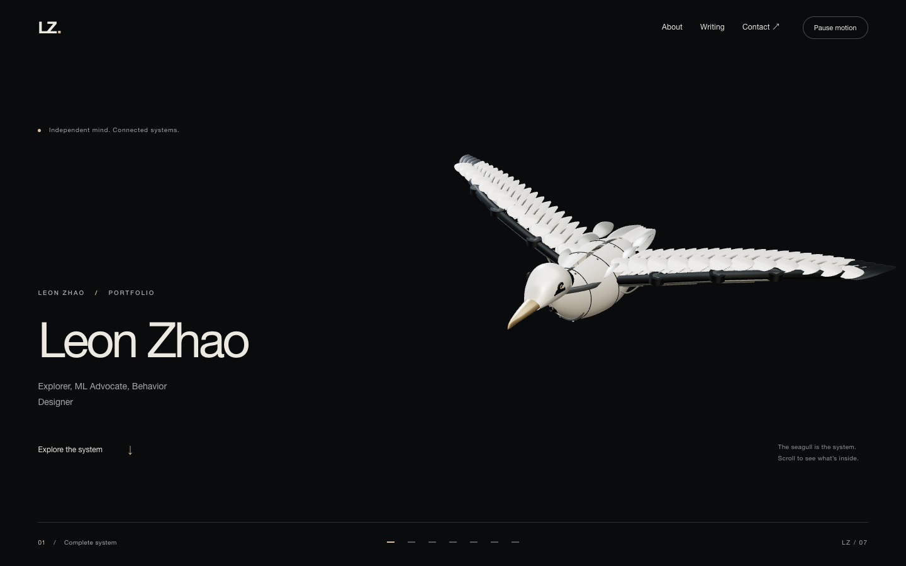
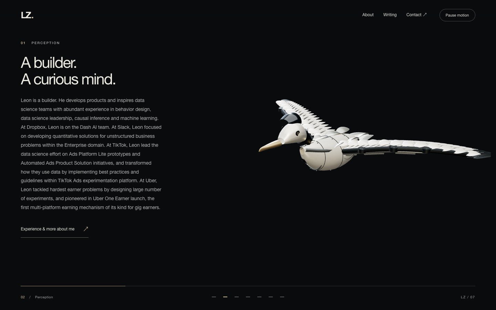
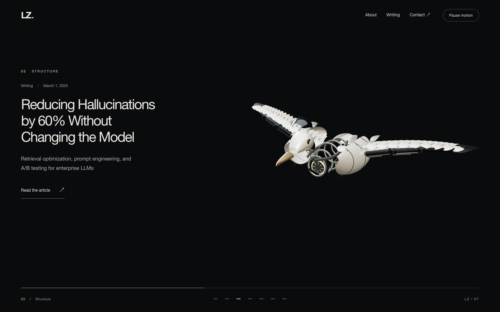
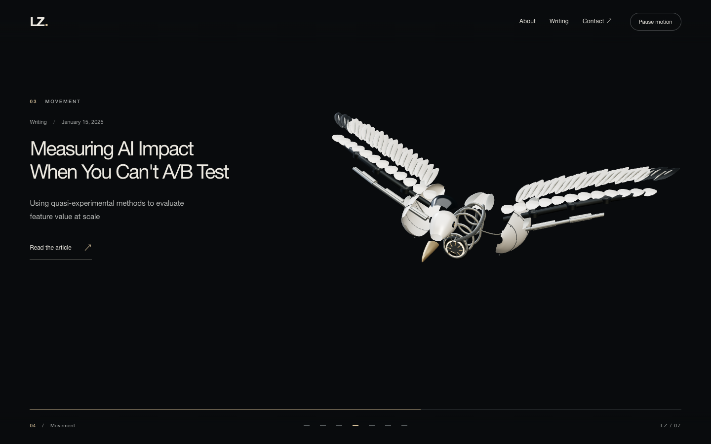
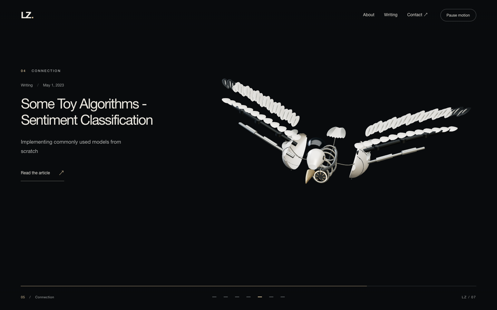
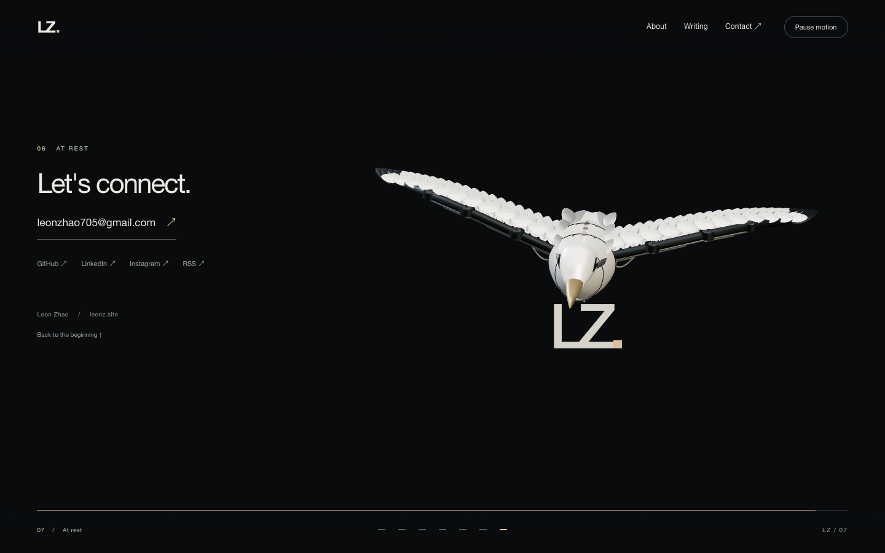
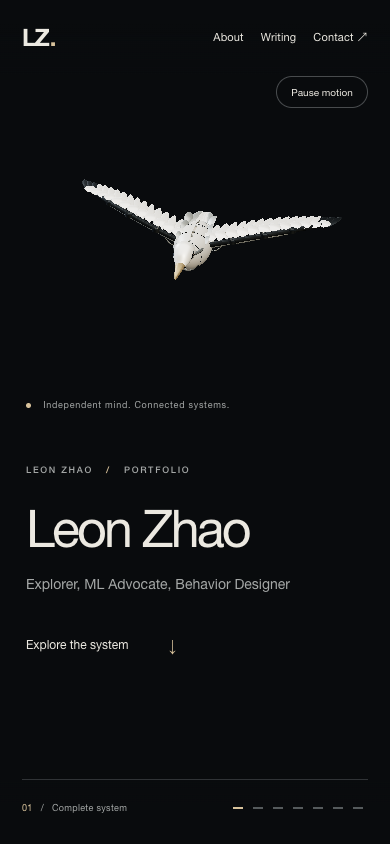
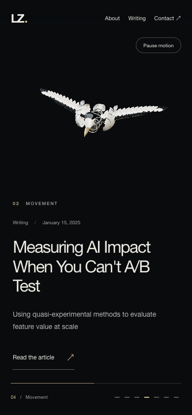

# Robotic seagull portfolio

The homepage presents Leon Zhao's existing bio and three articles alongside a scroll-driven mechanical seagull. The bird separates into perception, structure, movement and connection assemblies, then returns around a typographic LZ mark. The implementation extends the existing Jekyll site with browser-native ES modules and Three.js 0.186.0.

## Content and deployment

Baseline: `105c02c2fa89f46eadd134b9b44ea5b14d2ca84d` on `master`. All remote design branches were inspected; their useful changes were already merged. No botanical implementation was present.

The only change to `index.md` is its layout name. Its complete biography, name and subtitle remain the source of homepage content. Article scenes are generated from `site.posts`, with each post's real title, subtitle, date and URL. Contact links use the existing site configuration. No experience, results or metrics were invented.

The following generated files were compared with a fresh baseline build and were byte-identical: `me.html`, `writings/index.html`, all three article pages, and `feed.xml`. Homepage canonical, description and Open Graph title also match the baseline. Existing page/post layouts, full article sources, `/me`, `/writings/`, article permalinks, canonical domain `https://leonz.site`, social links and feed are preserved.

The existing Pages deployment workflow remains unchanged and deploys only from `master`. The added pull-request workflow has read-only repository permissions and performs validation; it does not deploy. Three.js is vendored, so Pages still needs only the Jekyll build. Node and Ruby dependencies are locked.

## Architecture and editing map

| Responsibility | Files |
| --- | --- |
| Semantic page, navigation, bio, article scenes, contact | `_layouts/portfolio.html`, `_includes/portfolio/` |
| Reading areas, stage placement, responsive layout, fallbacks | `assets/css/portfolio.css` |
| Custom curved armor and feather surfaces | `assets/js/portfolio/Geometry.js` |
| Bird anatomy, materials, mechanical parts and attachment points | `assets/js/portfolio/SeagullAssembly.js` |
| Named part registry and assembled/exploded local poses | `assets/js/portfolio/AssemblyParts.js` and the `parts.add(...)` calls in `SeagullAssembly.js` |
| Scene ranges, staggered disassembly and reassembly timing | `assets/js/portfolio/AssemblyTimeline.js` |
| Camera compositions and time-based damping | `assets/js/portfolio/CameraRig.js` |
| Normalized native-scroll progress | `assets/js/portfolio/ScrollController.js` |
| Cable geometry following real attachment points | `assets/js/portfolio/CableSystem.js` |
| Lighting and procedural reflection environment | `assets/js/portfolio/Lighting.js` |
| Renderer lifecycle, pointer damping, focus response, pause, cleanup | `assets/js/portfolio/Experience.js` |
| Deferred loading, quality choices and static state | `boot.js`, `QualityController.js`, `StaticFallback.js` in the same directory |

The model uses smooth lofted surfaces, cambered feather blades, metal rails, pistons and ribs. It has explicit parent relationships and local pivots. The same interpolation paths run forward and backward; no cumulative rotations or physics impulses are used. Cables rebuild only when their endpoints change. Idle motion fades out before contact, and all parts reach their exact assembled transforms by 94% progress.

No React migration, smooth-scroll hijack, scroll snapping, animation gate, image sequence or external model service is required. The finished bird is a reusable procedural assembly rather than a GLB.

## Accessibility and resilience

- Semantic headings, landmarks, a skip link, visible focus states and real HTML links.
- Focus entering an inactive scene scrolls to that scene in document order. Hover and keyboard focus use the same core-light response.
- A visible Pause motion button freezes the 3D state while ordinary reading and navigation continue.
- Reduced motion starts with the static poster and does not fetch Three.js. Changing the preference to reduced motion releases an active renderer.
- Missing WebGL, module/model failure and context loss restore the poster and retain all content. JavaScript-disabled reading works.
- Desktop keeps text separate from the sculpture. Mobile places the scene above the reading area and reduces feathers, curve segments, DPR and explosion distances.
- Rendering stops while the document is hidden. GPU geometry, materials and reflection targets are disposed on teardown.

## Build and preview

Use Node 22 and Ruby 3.3, matching CI.

```sh
bundle install
npm ci
npm run vendor
bundle exec jekyll build
PORT=4174 npm run preview
```

Open `http://127.0.0.1:4174/`. The preview server supports the existing extensionless `/me` URL. It binds to localhost.

```sh
npm test
npx playwright install chromium
npm run test:browser
```

For an installed Chrome instead, set `PW_CHANNEL=chrome`. `SCREENSHOT_DIR` overrides the browser-test screenshot destination. Tests start the local preview automatically when needed.

### Model review and poster

In another terminal, serve the source tree:

```sh
PREVIEW_ROOT=. PORT=4173 npm run preview
node scripts/capture-model.mjs
```

`scripts/model-review.html?view=front`, `?view=side` and `?view=three` render assembled anatomy. The `poster` query removes the review caption. The static poster was captured from this same model at 1440×900 and encoded to WebP (quality 87). Regenerate it after changing the anatomy or lighting. The default capture destination is `test-results/model/`.

## Validation

- Jekyll build passes on Ruby 3.3.9 / Jekyll 3.10.0.
- Three Node tests pass: exact pose restoration after arbitrary jumps, finite/reversible exploded state with correct hierarchy, reduced mobile geometry and cable attachment updates.
- Eight browser tests pass in Chrome: six major scenes; reverse/fast scrolling; pause/resume; keyboard and pointer interactions; back/forward; 1440×900, 1920×1080, 390×844 and 1024×600; reduced motion; WebGL disabled; context loss; failed model-module import; JavaScript disabled; existing routes/feed; no unexpected console errors or failed network requests in the normal path.
- Desktop text is checked against the sculpture's bounds and viewport edges. Mobile is checked for horizontal overflow and distinct reading space.
- Screenshots were inspected and the reading hold was extended to keep article text visible during the assembly sequence.
- Front, side and three-quarter anatomy reviews were performed before the scroll sequence was implemented.

### Performance sample

`scripts/measure.mjs` scrolls through the page across 180 animation frames. This is a development-Mac headless Chrome sample, not a real-device mobile benchmark.

| Viewport | Mean frame interval | Mean frame rate | Geometry excluding cables |
| --- | --- | --- | --- |
| 1440×900 | 16.67 ms | 60 fps | 69,440 triangles / 209 meshes |
| 390×844 emulation | 16.67 ms | 60 fps | 45,536 triangles / 149 meshes |

The vendored Three.js module is 742,309 bytes, or 190,855 bytes when gzipped; the WebP poster is 18,386 bytes. Actual transfer compression depends on the host. No realtime shadows, transmission, bloom passes or external textures are used.

## Limits

This is an original procedural model with intentionally simplified surface detail. It does not reproduce the photorealistic micro-machinery of the generated reference; a professionally authored GLB could refine that further while retaining the existing component and timeline interfaces. The LZ mark is typographic because no separate vector mark was supplied.

The video references were supplied as screenshots: their lighting, negative space and tactile industrial presentation informed the design; their motion could not be inspected. Real iOS/Android hardware and Safari were not tested. Existing Jekyll pagination and Ruby future-default-gem warnings also appear on the unchanged baseline; they do not fail the build. No merge or live deployment has been performed.

## Preview gallery









